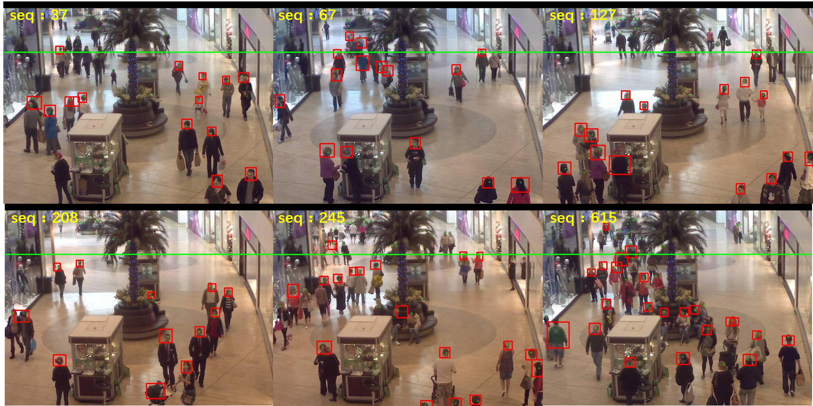

# Face Detection

This project is based on [TensorBox](https://github.com/TensorBox/TensorBox).

## Installation Dependencies

* tensorflow == 0.12
* scipy == 0.18

The model uses the GoogLeNet network to extract the features of the image, and then uses the LSTM network to predict the face position and regress the face size. The system runs on the ARM-based Raspberry Pi development board, and the open surveillance video dataset is used to test the system. The results show that the recall and precision score of the system are 55.4% and 90.3% respectively, and the system has a powerful ability to detect face in the crowd.

The detection result shows as below:

The area above the green line is far away the camera, so the detection results of the algorithm do not count in the statistics.